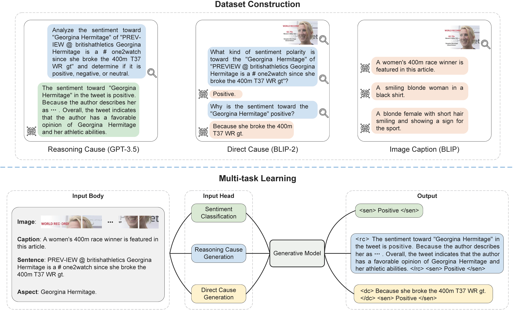

# MDCA: Multimodal dual cause analysis

This repo provides the source code and data for the paper Dual Causes Generation Assisted Model for Multimodal Aspect-based Sentiment Classification

----------

## Overview

<p align="center">
  
</p>

----------

## Code Usage

----------

### Requirements

- Python == 3.11.14
- PyTorch == 2.0.1
- transformers == 4.32.1

----------

### Datasets
1. Text data: Twitter2015 ([twitter2015](data/twitter2015)) and Twitter2017 ([twitter2017](data/twitter2017)).
2. Image features data: Download from [Google Drive](https://drive.google.com/drive/folders/1F-cjyNCm57gpJd0Rt4zWJCjt_mvbOWwu?usp=sharing). Put them to the fold `data/twitter2015` and `data/twitter2017`.

----------

### Pretrained Models
- Use the BART as the backbone: Download [facebook/bart-large-cnn](https://huggingface.co/facebook/bart-large-cnn) to `pretrained/bart-large-cnn`.
- Use the Flan-T5 as the backbone: Download [google/flan-t5-base](https://huggingface.co/google/flan-t5-base) to `pretrained/flan-t5-base`.

----------

###  Training and Evaluating 
Use BART：
```
python run_bart.py
```
Use Flan-T5：
```
python run_flant5.py
```
Some important arguments:
- `--cuda_id`: Choose which GPUs to run (default is 0).
- `--dataset_name`: Name of the dataset. Choices are 'twitter2015' or 'twitter2017'.
- `--learning_rate`: The initial learning rate for Adam.
- `--num_train_epochs`: Total number of training epochs to perform.
- `--lamda`: A trade-off hyperparameter for the main loss.
